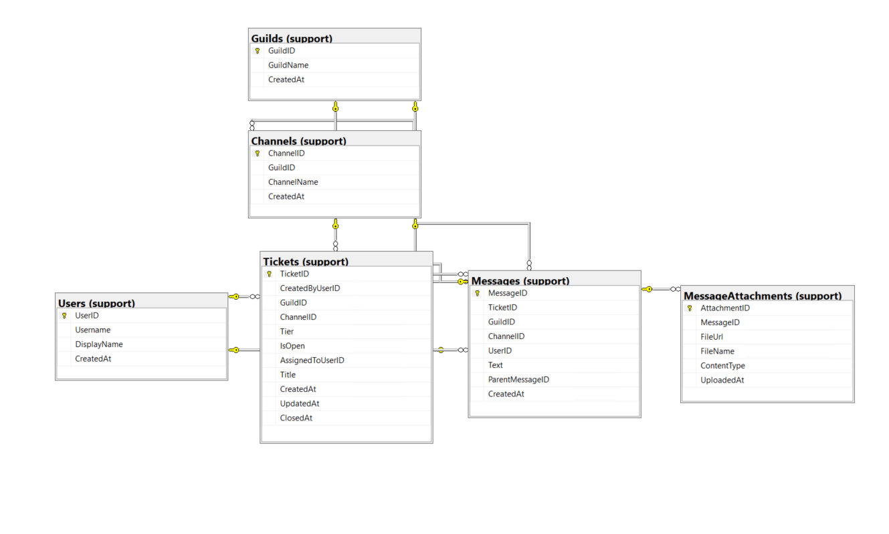

# IT-Support-Ticketing-System

SQL Server MVP implementation of an IT Support Ticketing & Escalation System with relational schema, stored procedures, ERD, and backend-ready architecture.

---

## Architecture Overview

This project demonstrates:

- Normalised relational schema design (3NF)
- Referential integrity enforcement
- Workflow-based ticket lifecycle control
- Stored procedure-based backend logic
- Escalation tier validation (1–5)
- Automatic timestamp updates via trigger

System Flow:

User → API Layer → Stored Procedures → SQL Server

---

## Entity Relationship Diagram

---

## Technologies Used

- Microsoft SQL Server
- SQL Server Management Studio (SSMS)
- Azure Lab Services (University VM)

---

## How to Build

1. Open `database/master-build.sql`
2. Execute the script (F5)
3. Run `database/test-calls.sql` to validate functionality

---

## Core Stored Procedures

- `sp_CreateTicket`
- `sp_AddTicketMessage`
- `sp_AssignTicket`
- `sp_CloseTicket`
- `sp_GetTicketThread`
- `sp_ListOpenTicketsByTier`
